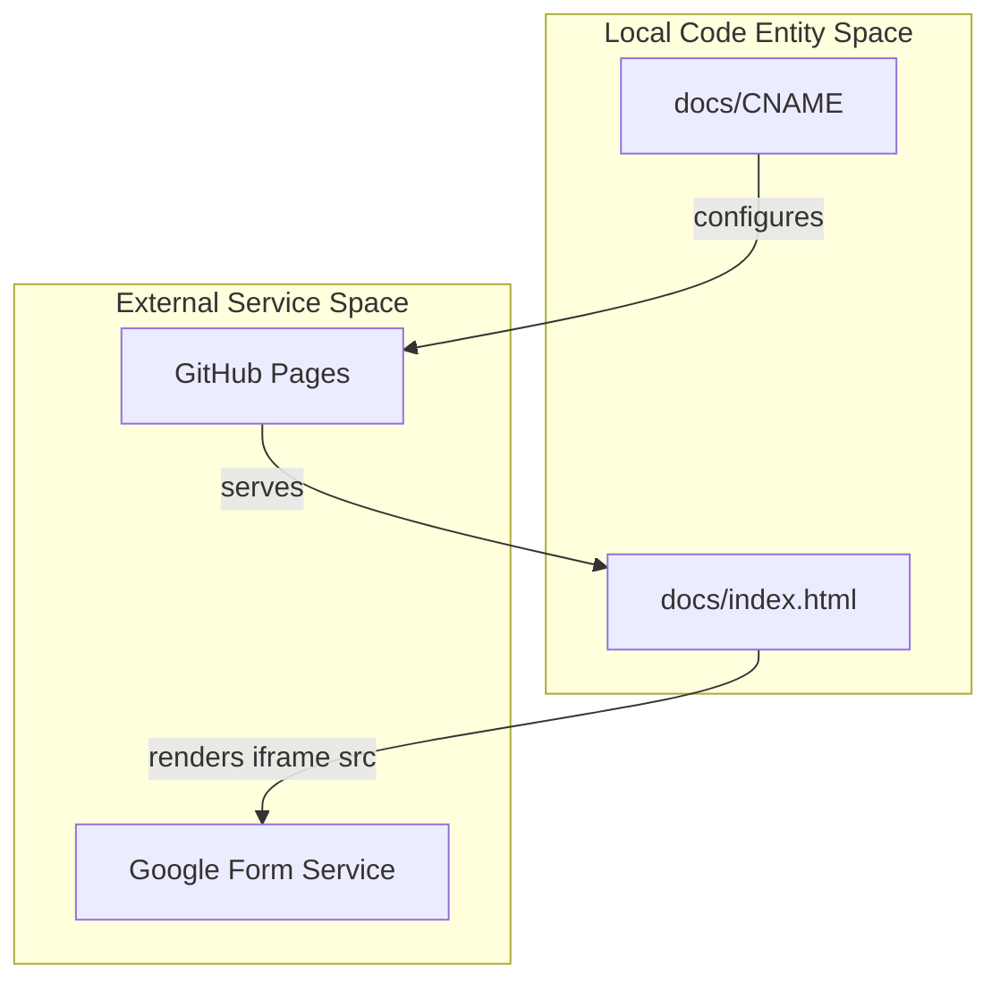

# Mail - Minimalist Contact Form

A lightweight, static web application that provides a personal contact form interface using Google Forms as the backend. This "zero-backend" solution eliminates the need for server maintenance while ensuring security and high availability.

## Features

- **Static Site Architecture**: Single-page application with no backend dependencies
- **Google Forms Integration**: Leverages Google Forms for data collection and processing
- **GitHub Pages Ready**: Optimized for deployment on GitHub Pages
- **Custom Domain Support**: Includes CNAME configuration for custom domains
- **Responsive Design**: Mobile-friendly layout with inline CSS
- **Zero Maintenance**: No server or database management required

## Architecture

The project consists of a static site that delegates all form processing to external services:



## File Structure

```
mail/
├── docs/
│   ├── index.html    # Main application file
│   └── CNAME         # Custom domain configuration
└── LICENSE           # GPLv3 license
```

### Core Components

- **`docs/index.html`**: The main application file containing HTML5 structure, inline CSS styling, and the iframe element for embedding the Google Form [1](#0-0) 
- **`docs/CNAME`**: Configuration file for mapping GitHub Pages deployment to a custom domain
- **`LICENSE`**: GPLv3 license ensuring the project remains open-source

## Getting Started

### Prerequisites

- A Google Account (for creating Google Forms)
- A GitHub Account (for hosting on GitHub Pages)
- Optional: Custom domain name

### Setup Instructions

1. **Clone the Repository**
   ```bash
   git clone https://github.com/Rupkumar-Khatua/mail.git
   cd mail
   ```

2. **Create Your Google Form**
   - Go to [Google Forms](https://forms.google.com)
   - Create a new form with your desired fields
   - Click "Send" → "Embed" → "Copy HTML"

3. **Update the Form URL**
   - Open `docs/index.html`
   - Replace the iframe `src` attribute with your Google Form embed URL [2](#0-1) 

4. **Deploy to GitHub Pages**
   - Push the repository to GitHub
   - Enable GitHub Pages in repository settings
   - Select `docs/` folder as the source

5. **Custom Domain (Optional)**
   - Update `docs/CNAME` with your domain name
   - Configure DNS settings as per GitHub Pages documentation

## Technical Implementation

### HTML Structure

The application uses semantic HTML5 elements:
- `<header>`: Contains the page title and description [3](#0-2) 
- `<section id="contact-form">`: Wraps the iframe element [2](#0-1) 
- `<iframe>`: Embeds the Google Form with responsive dimensions [4](#0-3) 

### CSS Styling

Inline CSS provides a clean, responsive layout:
- Centered content with maximum width of 600px
- Sans-serif font for readability
- Full-width iframe with subtle border [5](#0-4) 

## License

This project is licensed under the GNU General Public License v3.0. See the [LICENSE](LICENSE) file for details.

## Contributing

Contributions are welcome! Please feel free to submit a Pull Request.

## Support

For issues and questions:
1. Check the existing issues on GitHub
2. Create a new issue with detailed information
3. Use the contact form on the deployed site (if available)

---

## Notes

This documentation is based on the project's Overview wiki page and the main HTML file. The project is designed to be a minimal, maintenance-free solution for contact forms, making it ideal for personal websites, portfolios, or small business sites that need a simple way to collect user messages without managing backend infrastructure.

Wiki pages you might want to explore:
- [Overview (Rupkumar-Khatua/mail)](/wiki/Rupkumar-Khatua/mail#1)


